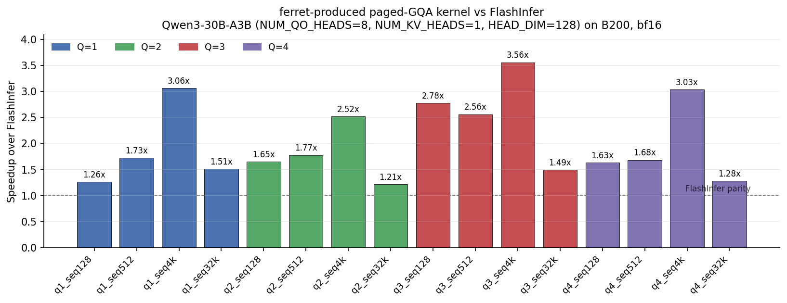

# ferret

**Autonomous CUDA-kernel agent. Give it a problem, get a kernel that beats the vendor library.**



Above: an attention kernel produced by ferret on a fresh `task.yaml` —
**1.21× to 3.56× faster than FlashInfer** across all 16 (Q × seq) configurations
of Qwen3-30B-A3B (B200, bf16). 22 iterations, 1 self-contained binary, all 16
correctness-passing. Numbers measured against FlashInfer 0.6.8 using identical
2-sec warmup + 128 MB L2 flush + 300-iter median harness in both kernel and
baseline.

## What ferret does

ferret reads a YAML task spec (problem shape, baseline, target ratios) and runs
a structured **REPRODUCE → OPTIMIZE** loop with a Claude agent under the hood.
Each iteration the agent edits CUDA, ferret compiles + benchmarks + checks
correctness against an in-binary fp32 reference, then scores against the
baseline. Wins get git-tagged; regressions get reverted.

## Verified wins

Three representative workloads, each measured on B200 (one GPU, same physical
session), saved under `examples/`:

| Workload | Baseline | Speedup | Artifact |
|---|---|---|---|
| **Paged GQA decode** (Qwen3-30B-A3B, 16 configs Q×seq) | FlashInfer 0.6.8 | **1.21× – 3.56×** (geomean 1.93×) | [`paged-gqa-fused-qwen3/v011_fused_all16_115x.cu`](examples/paged-gqa-fused-qwen3/v011_fused_all16_115x.cu) |
| **FP8 MLA decode** (DeepSeek-V4 MODEL1, b=2, h_q=64) | FlashMLA | **1.14×** | [`fp8-mla-decode-dsv4/v033_partial_match_785.cu`](examples/fp8-mla-decode-dsv4/v033_partial_match_785.cu) |
| **Decode linear projections** (Qwen3-8B, M=16, GateUp) | cuBLAS BF16 | **1.17×** | [`qwen3-8b-decode-linear-bs16/v019_swapab_cg2_l2hints.cu`](examples/qwen3-8b-decode-linear-bs16/v019_swapab_cg2_l2hints.cu) |

All wins are reproducible from the saved `.cu` — each binary self-contains its
benchmark harness, fp32 correctness check, and (where applicable) the
baseline measurement.

## Quick start

Requires Python 3.12+, CUDA toolkit on the build host, and an `ANTHROPIC_API_KEY`.

```bash
pip install lithosai-motus pyyaml
export ANTHROPIC_API_KEY=...

# Run from the parent of ferret/
cd ~/repos
python -m ferret.main ferret/tasks/paged-gqa-fused-qwen3.yaml
```

ferret writes per-iteration state to `ferret/workspace/` (git commits, kernel.cu,
conversation log). Resume is implicit from git history — there is no
`--resume` flag.

## How it works

```
task.yaml ──► REPRODUCE stage ─► agent: get a correct baseline ─► gate at ratio
                  │
                  ▼  (stage_gate met)
              OPTIMIZE stage ─► each iteration:
                                  agent edits kernel.cu
                                  ferret compiles + benchmarks + correctness
                                  parses KERNEL_RESULT vs target_ratio
                                  if win → git tag, else → revert to last tag
              exit ─► best tagged kernel
```

Design choices that matter:
- **Structured `task.yaml`** is the single source of truth (problem, shapes,
  per-config baselines, constraints, hints, budget). The agent can't rewrite
  its own spec — `workspace/task.yaml` is read-only.
- **Per-config scoring** — `min_ratio`, `weighted_avg`, or `focus`. No
  `max()` across configs masquerading as "best TFLOPS".
- **Constraints re-injected every iteration**, not just iteration 0.
- **Stage gate + budget driven by the spec**, not hardcoded constants.
- **Git-tagged version tracking** — every iteration is a commit; only wins
  get tags. Revert after failure is `git checkout $(git describe --tags --abbrev=0)`.

## Authoring a task

Minimal `task.yaml`:

```yaml
name: my-kernel
gpu: B200
arch: sm_100a
precision: BF16

problem:
  description: |
    What the kernel should compute. Include layout, sm_scale,
    mask semantics, anything the agent must respect.

baseline:
  source: "Library X — run: python3 baselines/my-kernel/baseline.py"

configs:
  - name: shape_1
    args: { M: 1, N: 4096, K: 7168 }
    target_ratio: 1.10        # beat baseline by 10%

scoring: min_ratio            # or weighted_avg / focus
stage_gate: { ratio: 0.85, strict: false }

constraints:
  - "Single self-contained kernel.cu, compile with nvcc -arch=sm_100a ..."
  - "Output must match fp32 reference within max relative error < 1e-2."
  - "MANDATORY L2 FLUSH + 2-sec warmup + 300-iter median."

budget:
  max_iterations: 60
  max_wall_minutes: 240
```

Templates and verified examples live in `tasks/`. Validate a new spec with:

```bash
python ferret/task_spec.py path/to/your_task.yaml
```

Then run it:

```bash
python -m ferret.main path/to/your_task.yaml
```

## Layout

```
ferret/
├── main.py              entry — validates spec + launches orchestrator
├── orchestrator.py      main loop, stage gate, prompt rendering
├── agents.py            ReAct agent + tool bindings
├── prompts.py           system prompt
├── task_spec.py         spec schema + loader + scoring + result parser
├── state.py             RunState + compute_state (git → decision)
├── tasks/               authored task.yaml specs (template + examples)
├── tools/               agent tool implementations (compiler, tester, …)
├── docs/                reference material the agent reads
├── examples/            saved win kernels from prior runs
└── workspace/           per-run state (gitignored, regenerated each run)
```

`resources/` (vendored CUTLASS, FlashInfer, FlashMLA, ThunderKittens, …) is
gitignored; manage as git submodules. After any submodule change run:

```bash
python scripts/check_resource_refs.py           # must exit 0
python scripts/check_resource_refs.py --verbose # per-submodule ref counts
```

## Lineage

ferret is the clean rewrite of `cuda_agent_v3` at
`lithos-cuda-example/examples/cuda_agent_v3/`. v3 produced real wins on
DeepSeek V3 MLA kernels (prefill, decode, multi-token decode) but accumulated
technical debt around multi-config scoring, agent-generated spec files, and
forgotten constraints in long sessions. ferret fixes those at the architecture
level. The v3 directory stays frozen as a reference.
